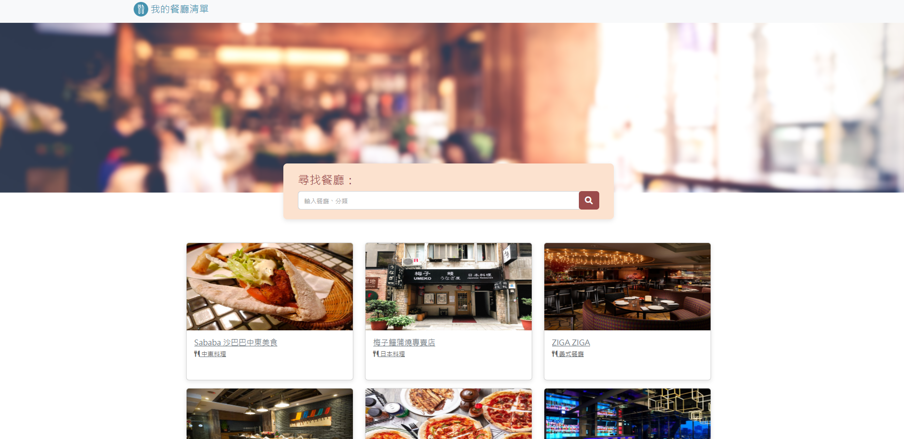

# My Restaurant List



## About

Displays a list of restaurant with a simple search bar

### Functions

- Display all restaurants
- Display restaurant details when clicked
- Connect to Google maps when icon is clicked
- Search restaurants via name or category

## Installation

1. Check if node.js and npm is installed
2. Clone project to local 
3. Navigate to the project folder via the terminal, then install：

   ```bash
   npm install
   ```

4. Then：

   ```bash
   npm run start
   ```

5. If the code is running successfully(see message below), open your browser and go to http://localhost:3000

   ```bash
   Listening on http://localhost:3000
   ```

6. To stop the program:

   ```bash
   ctrl + c
   ```

## Tools

- Node.js 14.16.0
- Express 4.16.4
- Express-Handlebars 3.0.0
- Bootstrap 5.2.0
- Font-awesome 6.1.2